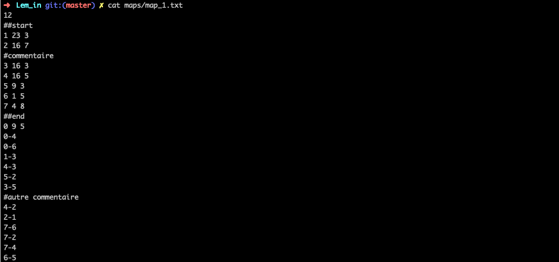
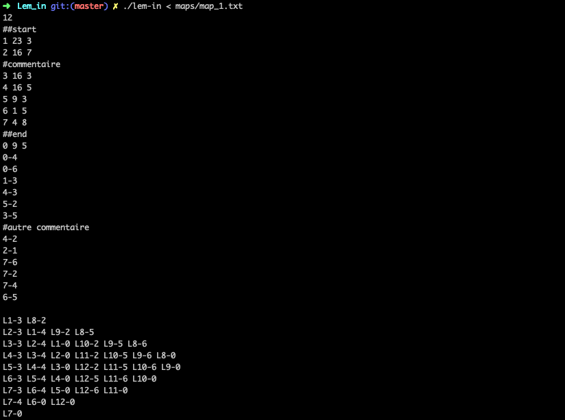
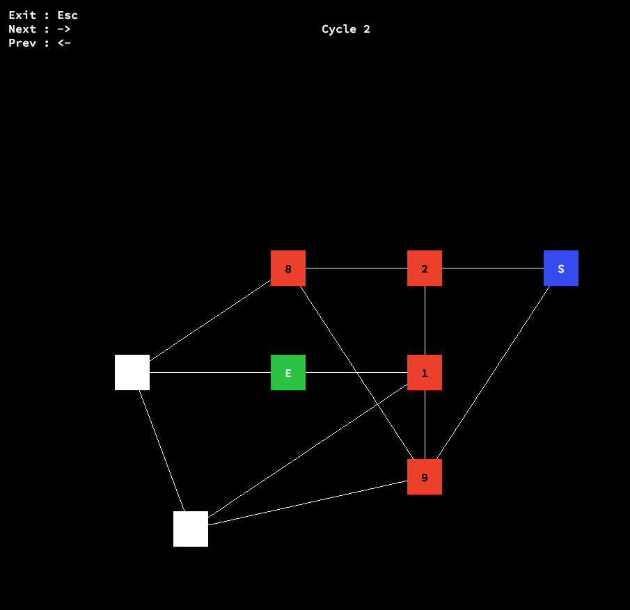

# Lem_in

The objective of this project is to find the most efficient way for ants to go from `start` to `end` in the graph. They can take multiple path at the same time.

The input map is formated as below.

## Solution output

The output must fisrt show the map then the position of each ant at a time.

## Visualizer

In order to see how each ant moves we did a visualizer. We can see the ant number and how they move through different cycles.

    

### Final mark (125/125)